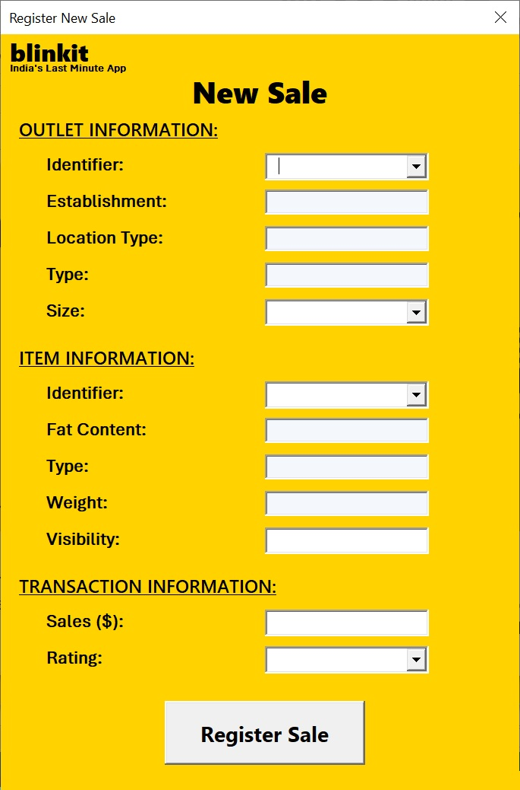

# Sales Data Automation & Interactive Dashboard

## Project Overview
This project automates the data lifecycle for a sales department, managing over **8,500 records**. It combines a VBA-powered data entry system with a high-impact interactive dashboard for commercial KPI tracking.

### Interface Previews

**1. Main Menu (Home)**
The central hub of the application, allowing users to navigate between the database, the automated import tools, and the visual analytics.

**2. Interactive Sales Dashboard**
A comprehensive view of business performance. It features dynamic filtering and automated updates to track core commercial metrics.

**3. VBA Automation Form**
Custom-built UserForm designed for efficient manual data entry.

---

## Key Functionalities
* **VBA Automation:** Custom UserForm interface for manual data entry and high-speed bulk CSV importing.
* **Data Integrity:** Automated cleaning and consistency checks using `VLOOKUP` for cross-referencing and strict data validation rules.
* **Commercial Analytics:** Dynamic Pivot Tables that calculate month-over-month (MoM) growth, regional performance, and top-selling products.
* **Interactive UI:** A professional dashboard equipped with Slicers and Timelines for **on-demand** data filtering and drill-down analysis.

## Testing the CSV Import
You can test the automation logic using the sample data provided:
1. Open `src/sales_automation_dashboard.xlsm`.
2. Use the **"Import Sales (CSV)"** button located in the Home or Import section.
3. Select the file: `/data/sales_20250119.csv`.
4. Observe how the system parses the data, updates the database, and refreshes all dashboard charts automatically.

## Technical Stack
* **Advanced Excel:** Pivot Tables, Dynamic Arrays, and Conditional Formatting.
* **VBA Macros:** Custom UserForms and FileSystemObjects for efficient CSV parsing and UI navigation.
* **Data Visualization:** Design of business-ready KPIs and interactive dynamic charts.

## Project Structure
* **`/src`**: Contains the main application (`sales_automation_dashboard.xlsm`).
* **`/data`**: Includes `sales_20250119.csv` for import testing.
* **`/docs`**: High-resolution screenshots of the Home, Dashboard, and VBA interfaces.
